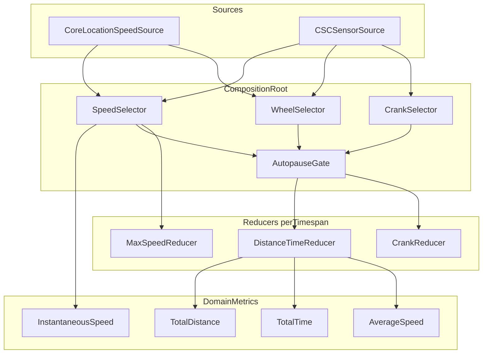

# Metrics: Mental Model and Code Model

**Status**: Accepted design reference (implementation in progress)
**Date**: 2026-09-09
**See also**: [ADR-0004](adr/0004-metrics-reducers-projections-snapshots.md) (architecture), [PDR-0008](pdr/0008-autopause-moving-time.md) (autopause and moving time)

This document describes how ride metrics are modeled, computed, persisted, and wired — from sensor sources to the fields that display them. UI concerns (pages, fields, layouts) are out of scope except at the boundary.

## 1. Product constraints this model serves

From [`abstract.md`](../abstract.md) and [`docs/requirements.md`](requirements.md):

- The app displays **instantaneous metrics** (speed, cadence, later heart rate and power) and **time-boxed metrics** (distance, time, averages, maximums).
- Exactly **two time boxes**: **total** (forever) and **trip** (manually resettable). There is no ride start/stop; the app is not a ride tracker. Sliding windows ("last hour") are explicitly out of scope; this model requires only scalar state, not sample history.
- **Time** is **moving time**: it accrues only while speed is at or above the autopause threshold ([PDR-0008](pdr/0008-autopause-moving-time.md)).
- Sources: phone location, CSC BLE sensors, Apple Watch (later). Heart rate: HRS BLE, Watch.
- Streams are `AsyncSequence`/`AsyncStream`, never Combine ([ADR-0001](adr/0001-asyncsequence-not-combine.md)).
- All reducer state must survive app termination: **total** accumulates across launches forever; **trip** accumulates until the rider resets it.

## 2. Mental model

### 2.1 Three kinds of metrics

| Kind | Examples | State | Timespan |
|---|---|---|---|
| **Instantaneous** | speed, cadence, heart rate, power | None | None |
| **Reduction** | distance, time, max speed, revolutions | One small persisted state struct per timespan | Required |
| **Projection** | average speed, average cadence | None (pure function of one reduction's state) | Inherited from the reduction |

- An **instantaneous metric** is a stateless relay of a source's best current estimate.
- A **reduction** folds a stream of events into scalar state, scoped to a timespan. Sum-of-deltas (distance, time, crank revolutions) and running-max (max speed, max cadence) are the same shape — only the fold function differs.
- A **projection** is a pure computed value over a reduction's state: average speed = Σdistance / Σtime. Projections are more accurate than averaging instantaneous samples because they are immune to sample-rate bias.

Conceptually, instantaneous speed is itself a projection (Δd/Δt as the window approaches zero) — but the app deliberately does **not** compute it that way, because each source has a better, source-specific method (see §2.3).

A reduction is `state′ = f(state, sample)` plus a reset event that returns state to its identity value. The **fold** is the function `f`, applied over the event sequence from an initial state. Reduction state is a small **fixed-size struct** (one or more scalars), persisted as a unit — not sample history. For example, `DistanceTimeReducer` holds (Σdistance, Σtime); a hypothetical `AverageReducer<T>` could hold (mean, n) for a Welford-style running mean, though this project prefers (Σquantity, Σt) for averages to avoid sample-rate bias.

### 2.2 The delta sample: the atomic unit of accumulation

The central design commitment: **a quantity delta and its time delta travel together in one event** and are folded in one state transition.

```swift
struct WheelSample: Sendable {
    let deltaDistance: Measurement<UnitLength>
    let deltaTime: Measurement<UnitDuration>
}

struct CrankSample: Sendable {
    let deltaRevolutions: Int
    let deltaTime: Measurement<UnitDuration>
}
```

**There is no app clock on the accumulation path.** The `deltaTime` in a sample is the source's own measurement of the interval between the two events that produced the delta:

- **CSC wheel sensor**: difference of the sensor's event timestamps (the 1/1024 s field in the measurement) — the interval over which those wheel revolutions happened.
- **Phone location**: difference of `CLLocation.timestamp` between consecutive fixes — the interval over which that Δdistance was covered.

If a source emits at 0.75 Hz, distance **and** time both accrue at 0.75 Hz, in the same events. Out-of-sync is impossible because there is no second stream to be out of sync with.

**Per consistency group, each ratio uses its own Δt stream:**

- Wheel/location samples carry wheel-event-interval Δt → average speed = Σdistance / Σt(wheel).
- Crank samples carry crank-event-interval Δt → average cadence = Σrevolutions / Σt(crank).
- A future heart-rate group carries its own Δt (formed from consecutive HRS measurements).

Each ratio's denominator is measured by the same events as its numerator. The groups may drift slightly relative to one another; that is harmless because nothing divides a wheel quantity by a crank Δt.

**Displayed Time** is not a separate clock stream. It is a **projection** of `DistanceTimeReducer`'s Σt — the wheel/location group's accumulated time. Displayed time, distance, and average speed are therefore mutually consistent (a rider sanity-checking "does distance ÷ time equal my average speed?" gets a yes). Because the phone location source always exists, this canonical time is always available.

**Source switching** swaps Δd and Δt providers atomically because they live in one sample stream. At switchover, the new source's first delta has no defined interval start; the selector **drops the first sample** after a switch (or the source measures from subscription).

#### Why independent accumulators mispair

If distance and time are split into two independent streams, each folded separately, any downstream consumer that joins them (e.g. average speed = latest distance ÷ latest time) can read the two folds at *different positions in the event sequence* — distance-after-event-42 over time-after-event-41. No downstream join can repair this, because neither stream carries "which event am I at." The resulting bias is worst when the denominator is small (early in a trip).

The fix is not a synchronization impulse; it is a **shared fold**: quantities that feed one projection are folded together, in one reducer, from events that carry both deltas. Every emitted state is a fold of a single totally-ordered event prefix.

### 2.3 Sources publish each quantity their own best way

Every speed/distance source publishes **both** an instantaneous speed stream and a wheel-sample delta stream, each computed by the source's best available method:

| Source | Instantaneous speed | Δdistance |
|---|---|---|
| **Phone location** | `CLLocation.speed` (Doppler-derived — better than differencing positions) | Source's choice: speed × Δt, or position deltas gated on `horizontalAccuracy` (raw position sums overestimate distance due to GPS jitter) |
| **CSC wheel sensor** | wheel revs × circumference ÷ event-time delta (CSC event timestamps have 1/1024 s resolution) | revolutions × configured wheel circumference — a direct measurement |
| **Watch** (later) | whatever WatchConnectivity/HealthKit provides best | same principle |

Rules:

1. **Never re-derive a quantity a source already publishes.** Publishing a stream is the source asserting "this is my best estimate."
2. **The app never chooses between "a speed stream" and "integrating deltas."** It only ranks *sources* (see §2.6).
3. Source-specific concerns stay inside the source: CSC cumulative-counter rollover (uint32 wheel, uint16 crank), sensor-reboot counter resets, GPS accuracy gating, unit conversions from raw sensor data.

Within a source, prefer the published speed stream over integrating its own delta-distance stream. Across sources, prefer CSC over phone location when available — a wheel sensor is a direct measurement that works in tunnels and at low speeds where Doppler degrades.

### 2.4 Timespans: identity plus reset signal, nothing else

A `Timespan` holds **no metric state**. It is:

- an **identity** (`total`, `trip`) that reducers use to qualify their persistence keys, and
- a **reset signal** — an async stream of reset events that reducers subscribe to.

`total` never fires. `trip` fires when the rider resets it. There is no `start()`; per the product, the app has no ride lifecycle. When a reducer receives a reset, it zeroes its own state and persists immediately.

This keeps `Timespan` from becoming a god class: adding a new reducer never touches `Timespan`.

### 2.5 Consistency groups: state grouped by what a projection needs

The unit of shared state is not "everything in the timespan" (the rejected snapshot god object) and not "one scalar per metric" (the rejected split that causes mispairing). It is the **consistency group**: the minimal state that one projection must read atomically.

| Reducer (per timespan) | State | Fold input | Projects |
|---|---|---|---|
| `DistanceTimeReducer` | (Σdistance, Σtime) | `WheelSample` | distance, time, **average speed** |
| `MaxSpeedReducer` | max speed | instantaneous speed | max speed |
| `CrankReducer` | (Σrevolutions, Σtime) | `CrankSample` | **average cadence** |
| `MaxCadenceReducer` | max cadence | instantaneous cadence | max cadence |

Each reducer instance exists once per timespan it serves (e.g. `DistanceTimeReducer` × {total, trip}). Reducers are independent of one another; max speed has no consistency coupling to distance, so it stands alone. Later metrics (average heart rate, average power) follow the same recipe.

### 2.6 Source arbitration

A per-quantity **source selector** owns the ranked preference (CSC sensor > phone location). The selector:

- watches each source's `isAvailable` stream,
- forwards events from **exactly one** source at a time to downstream consumers,
- fails over automatically when the preferred source drops (sensor sleep, battery, range) and back when it returns.

Because reducers consume *deltas*, source switching mid-trip is safe by construction: the reducer sees a continuous stream of deltas and never knows the provenance changed. No double-counting, no jumps — except dropping the first delta after a switch. Arbitration sits **upstream of the reducers and autopause gate**, at the composition root.

### 2.7 Autopause: a gate on the sample stream

See [PDR-0008](pdr/0008-autopause-moving-time.md) for product rules. Architecturally, autopause is a single gate between the arbitrated sample stream and the reducers:

- When speed stays below the threshold, the gate **suppresses** `WheelSample`/`CrankSample` events (or zeroes their Δt).
- Moving time, distance, average speed, and average cadence all get correct pause behavior from one mechanism.
- **All** time-boxed reductions pause together, including max speed.

`AutoPauseDetector` (speed + threshold → `MotionState`) and `AsyncSequence.gated(by:)` (forwards samples only while `.moving`) are implemented in the Metrics package (`AsyncStream` per ADR-0001). Reducers consume the gated sample stream in a later phase; the composition root does not wire the gate until then.

### 2.8 Persistence

- **Reducers own their state and its persistence.** Each loads at init and saves via a small store abstraction.
- Keys qualify metric and timespan from `timespan.id`: `Metrics.DistanceTime.Trip`, `Metrics.MaxSpeed.Total`.
- Writes are throttled (every N seconds or M events) plus an immediate save on reset and on app-lifecycle events (background/termination notifications). Total must survive anything; losing a few seconds of trip data to a crash is acceptable.
- Storage format per reducer is its state struct (a couple of scalars) — no sample history anywhere.

### 2.9 End-to-end data flow



## 3. Code model

### 3.1 What already exists and stays

- `Metrics.Metric<MeasurementType>` — the domain protocol today (`values`, `isAvailable`, `source`). **Every metric the UI can display, including reductions and projections, will be exposed as `any Metric<…>`.** The kinds in §2.1 are implementation shapes.
- `RuntimeMetric`, `MetricWithSharing` / `.shared()` — multicast fan-out when one stream feeds several consumers.
- `LayoutsModel.Metric` + `RuntimeMetric` factories owning display names ([ADR-0003](adr/0003-ui-metric-types-own-names.md)). Unchanged; the boundary holds.
- `MetricSource` enum; DI with consumer-defined protocols and composition-root wiring.

### 3.2 MetricSnapshot: one stream, atomic metadata

Value, availability, and source are rendered together in a field, so they should travel together:

```swift
struct MetricSnapshot<Value: Sendable>: Sendable {
    let value: Value?              // last known; nil before first sample
    let isAvailable: Bool          // false ⇒ UI can gray out the stale value
    let source: MetricSource
}

// A domain metric is one AsyncStream<MetricSnapshot<Value>>
// plus whatever static metadata it needs.
```

This replaces three independent streams (`values`, `isAvailable`, `source`). Benefits:

- `source` is a stream for free — it changes when arbitration switches sources.
- Availability flips can carry the last-known value (gray out rather than blank a field).
- No way to render a value with mismatched metadata.
- New metadata is a new field on the snapshot; extensibility is preserved.
- `shared()` multicasts the snapshot stream the same way it multicasts today.

`source` answers **"where is my data coming from right now?"** (BLE icon, phone icon) — not the provenance history of an accumulated number.

Domain metrics stay **nameless** (ADR-0003).

### 3.3 New types (sketches, not final signatures)

**Timespan** — identity plus multicast reset signal:

```swift
public enum TimespanID: String, Sendable {
    case total = "Total"
    case trip = "Trip"
}

public final class Timespan: Sendable {
    public let id: TimespanID
    public var resets: AsyncStream<Void> { /* multicast */ }
    public func reset() { /* trip only; total's is never called */ }
}
```

**Reducer** — illustrated by the distance/time consistency group:

```swift
public struct DistanceTimeState: Sendable, Codable {
    public var distance: Measurement<UnitLength>
    public var time: Measurement<UnitDuration>

    public var averageSpeed: Measurement<UnitSpeed>? {
        guard time.value > 0 else { return nil }
        return Measurement(
            value: distance.converted(to: .meters).value / time.converted(to: .seconds).value,
            unit: .metersPerSecond,
        )
    }
}

public actor DistanceTimeReducer {
    // Consumer-defined dependencies per the project DI convention:
    public protocol StateStore { /* load/save Codable by key */ }

    private var state: DistanceTimeState   // loaded from store at init
    private let storageKey: String         // "Metrics.DistanceTime.\(timespan.id)"

    public var states: AsyncStream<DistanceTimeState> { /* multicast */ }

    // fold: consumes WheelSamples and timespan.resets;
    // apply → emit → throttled persist; reset → zero → emit → persist now
}
```

`MaxSpeedReducer` is the same pattern with `Measurement<UnitSpeed>` state folded by `max`, consuming the instantaneous speed stream. `CrankReducer` mirrors `DistanceTimeReducer` with (Σrevs, Σtime).

**Projections** — thin adapters from a reducer's state stream to `MetricSnapshot` streams:

```swift
// at the composition root, conceptually:
let tripAverageSpeed: any Metric<Measurement<UnitSpeed>> = /* maps
    tripDistanceTime.states.compactMap(\.averageSpeed) to MetricSnapshot */
```

Distance and time metrics are projections over the same state stream — guaranteed consistent with the average by construction.

**Source selector** — consumer-defined protocol over ranked sources, availability-driven, emits one source's events at a time. **Autopause gate** — consumes the selected speed stream for pause detection and gates the sample streams. Both live upstream of reducers and are wired at the composition root.

### 3.4 Source and library integration

- `CoreLocationSpeedSource` additionally publishes `wheelSamples: AsyncStream<WheelSample>` (Δdistance method internal to the source).
- [BluetoothBikeSensorSwift](https://github.com/tonytallman/BluetoothBikeSensorSwift) should expose `wheelSamples` (Δdistance, Δtime) and `crankSamples` (Δrevolutions, Δtime) alongside existing `speed`/`cadence`, keeping counter rollover and sensor-reboot handling inside the library. Δdistance uses the library-owned wheel circumference.
- App-side `CSCSensorSource` adaptor at the composition root, same shape as `CoreLocationSpeedSource`. The `Metrics` package never sees the library's types.
- [BluetoothHeartRateSensorSwift](https://github.com/tonytallman/BluetoothHeartRateSensorSwift) for future average heart rate: consistency group (Σ(hr × Δt), Σt) with samples formed from consecutive measurements.

### 3.5 Open code questions

1. First use of `merge` / `combineLatest` / `throttle` (selector, gate, persistence throttling) adds **swift-async-algorithms**, per ADR-0001's plan. Not Combine.
2. Clock discipline for Δt during background/suspension: delta streams pause if the app is suspended — consistent with "no data while not running" for moving time. Location continues during brief backgrounding ([REQ-SRC-001](requirements.md)).

## 4. Rejected alternatives

| Alternative | Why rejected |
|---|---|
| **Metric families** (`SpeedMetrics.average`) | Conflates stateless instantaneous metrics with per-timespan stateful ones; can't express several timespans per family cleanly. |
| **Whole-timespan snapshot god object** | Solves consistency but every sensor kind touches one type; maintenance cost demonstrated in Biker. Consistency groups keep the atomicity win at minimal scope. |
| **Independent scalar accumulators + downstream join** for averages | Mispairing: joins read two folds at different event positions; bias worst at small denominators. Unfixable downstream. |
| **`Timespan` holds metric state / `continue(from:)`** | Timespan becomes a god class touched by every new reducer; state belongs with the reducer that folds it. |
| **App-level speed from Δd/Δt** (source-agnostic) | Sources have strictly better methods (Doppler; CSC event timestamps). Never re-derive what a source publishes. |
| **Persist raw sample log, compute on demand** | Ride-tracker architecture; explicitly not this product. Scalars suffice for total/trip. |
| **Running mean of instantaneous samples** for averages | Sample-rate biased; (Σquantity, Σt) is preferred. |

## 5. Related documents

| Document | Role |
|---|---|
| [ADR-0004](adr/0004-metrics-reducers-projections-snapshots.md) | Architecture decision summary |
| [PDR-0008](pdr/0008-autopause-moving-time.md) | Autopause and moving time product rules |
| [ADR-0001](adr/0001-asyncsequence-not-combine.md) | AsyncSequence, not Combine |
| [ADR-0003](adr/0003-ui-metric-types-own-names.md) | UI metric display names stay in LayoutsModel |
